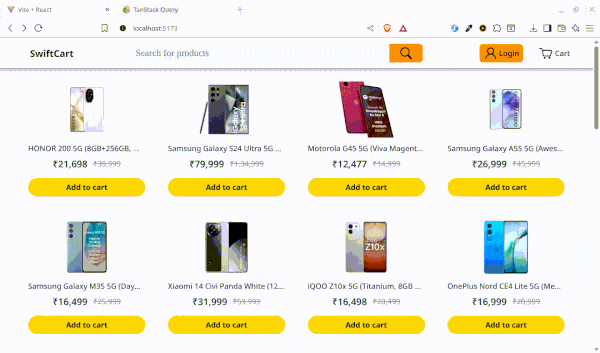
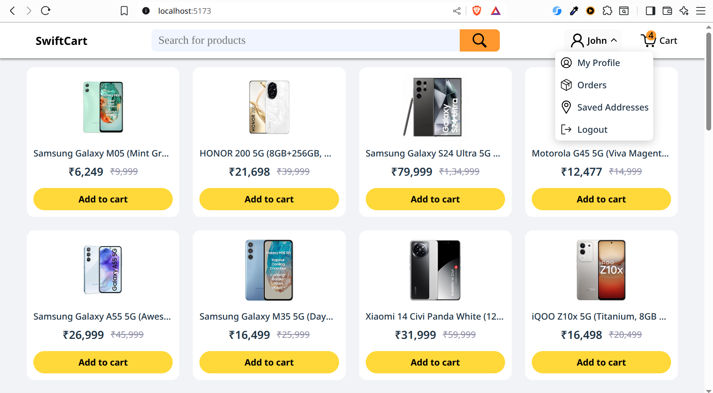
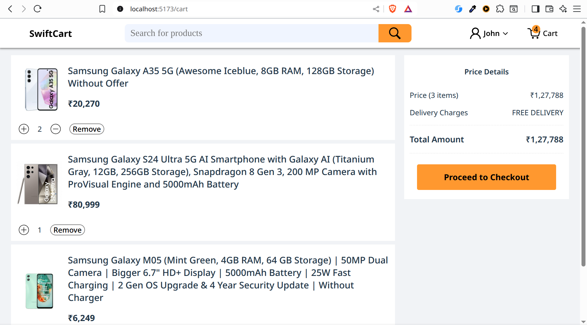
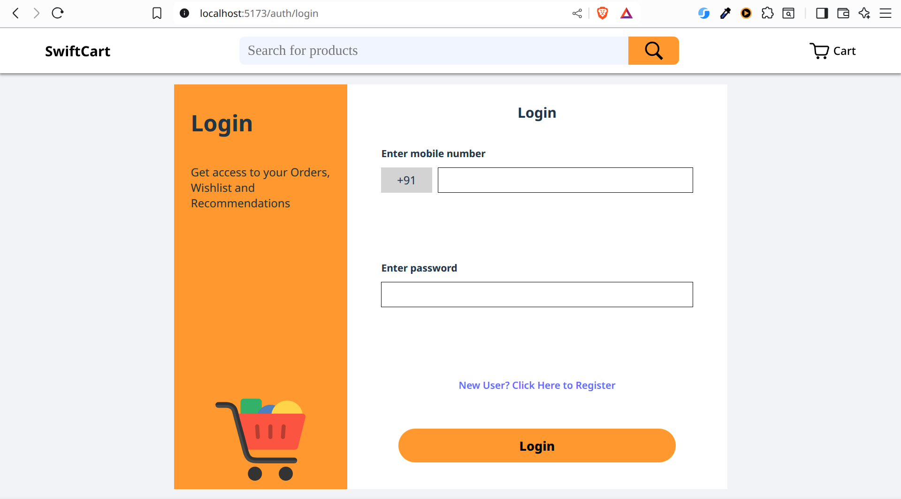
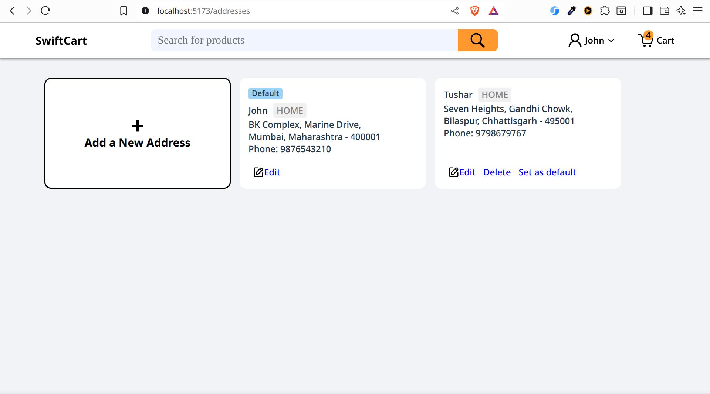
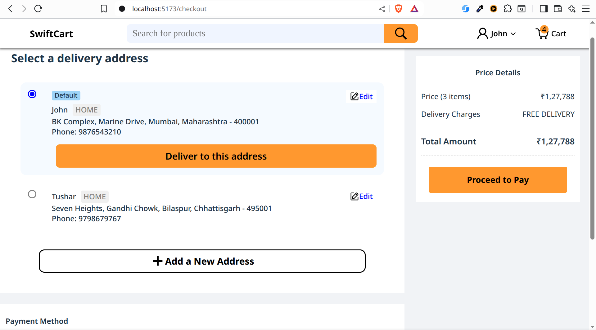
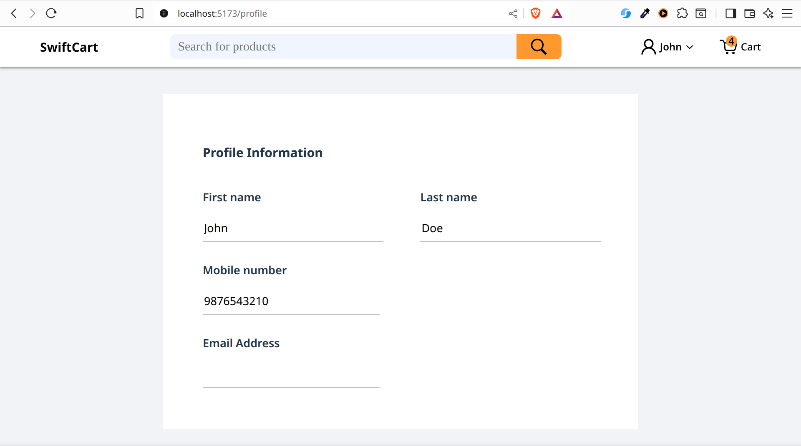
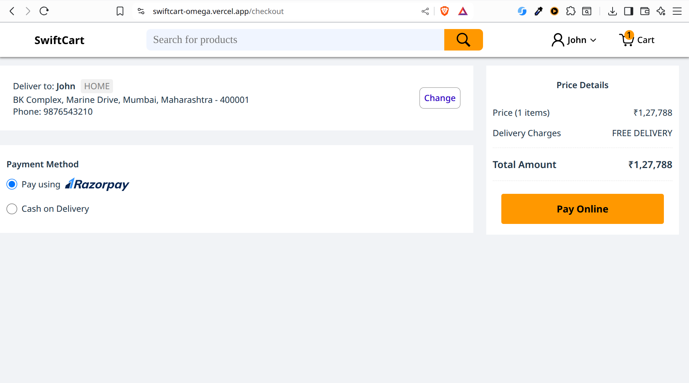
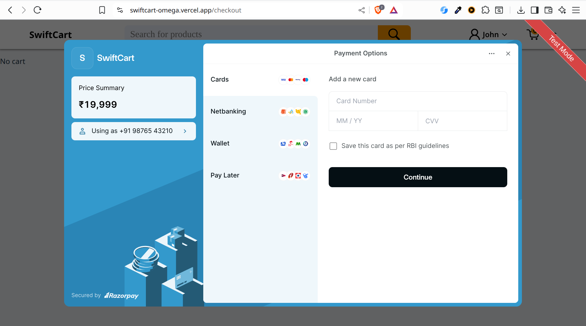
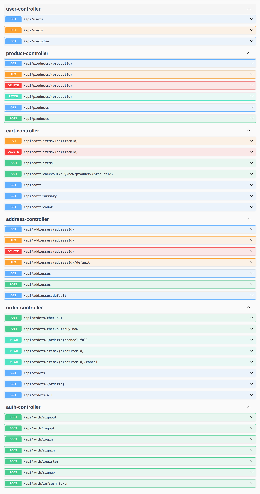

# SwiftCart

## Description
A full-stack e-commerce application built with **Spring Boot (backend)** and **React (frontend)**.  
It allows users to browse products, manage their cart, and securely complete purchases.  
Designed as a Single Page Application (SPA) with a responsive layout for both desktop and mobile.

---

## Tech Stack
- **Backend:** Spring Boot, REST APIs, Spring Data JPA, Spring Security
- **Frontend:** ReactJS, React Router  
- **Database:** SQL
- **Authentication:** JWT
- **Other Tools:** Git, GitHub, Maven, NPM, Vite

---

## Features
- User signup & login with JWT authentication
- Access & Refresh token mechanism (auto refreshes expired access token)
- Product catalog with search & filter
- Cart & checkout simulation
- Delivery Addresses management & selection
- Seller panel for managing products and orders
- REST API backend with Spring Boot
- Razorpay Payment Gateway Integration (test mode)
- Organized project structure (separate backend & frontend)
- Easy to deploy (can be hosted on Render / Railway / Vercel)

---

## Working GIF
Check out the app in action!<br /><br />


## Live Demo
[Click here to view the app](https://swiftcart-omega.vercel.app)

## Screenshots
- ### Home Page


- ### Cart Page


- ### Login Page


- ### Manage Addresses Page


- ### Select Address Page


- ### Profile Page


- ### Checkout Page


- ### Payment Page


## Run

### Backend
```bash
cd backend
./mvnw spring-boot:run
```

### Frontend
```bash
cd frontend
npm install
npm start
```

## API Documentation

This project includes **OpenAPI (Swagger UI)** for exploring and testing REST APIs.  

